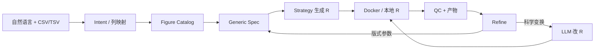

# SCIPlot AI

**面向生命科学的 AI Scientific Figure Agent**  
自然语言 → 可执行 Figure Spec → 可复现 R / ggplot2 → 隔离执行 → QC → 可 Undo 的精修循环

[](https://www.python.org/)
[](https://ggplot2.tidyverse.org/)
[](https://fastapi.tiangolo.com/)
[](./tests)
[](./LICENSE)
[](https://github.com/wrd970427-droid/SCIPlot-AI)

---

## 为什么要做这个 Agent？

生命科学论文里，**画图往往比分析本身更耗时**：换期刊版式、改点大小、把纵轴改成 `-log10(p)`、对齐 Nature / Cell 风格……大量工作重复、易错、难复现。

现有工具通常停在两类极端：

| 常见路径 | 痛点 |
|---|---|
| 纯对话 LLM「写一段 R」 | 不可控、难 QC、原始数据容易进模型、难版本化 |
| 固定 GUI / 模板出图 | 不会听自然语言，科学变换与版式精修都很僵硬 |

**SCIPlot AI** 想走第三条路：把科研绘图做成 **可编排的 Agent 系统**——LLM 负责理解意图与科学修改，**真正出图仍由结构化 Spec + 策略化 R 生成 + 本地/容器执行**完成，并始终守住一条红线：

> **原始表数据 / DataFrame 数值不进入 LLM。**

**为什么必须这样做？**  
很多小伙伴——尤其是医院、临床医疗工作者与医院科研人员——最担心的不是「图好不好看」，而是 **数据会不会泄露**：上传表格后，患者级别的检测值、临床字段、样本注释一旦进入公有云大模型，就可能触及患者隐私与院内合规红线,同时很多团队并没有把大模型部署在本地的硬件条件。SCIPlot 因此把边界写死：LLM 只看到「你想画什么、当前脚本怎么写」；**CSV/TSV 里的真实数值只在本地（或院内隔离环境）参与 R 出图**，不作为 Prompt 内容发给模型。这样既保留自然语言改图的便利，又尽量让医院场景敢用、能用。


我们相信：未来的科研绘图助手不该是「会聊天的代码粘贴机」，而应是 **懂图类型、懂统计与版式边界、可审计、可回退，并且把患者隐私放在第一位** 的 Figure Engineer。

---

## 主要特点

### 1. Catalog 驱动，而不是「一图一 Agent」
已整理 **86** 个生命科学常用 Figure family（转录组、单细胞、富集、临床、微生物组等）。新增可执行图类型的目标路径是：

`FigureDefinition + DataSchema + Strategy` —— 不必再复制一套 Workflow。

### 2. 结构化 Figure Specification
自然语言先落到可序列化的 Spec（列映射、统计阈值、视觉参数、期刊风格），再生成 R。Spec 可检查、可 diff、可进历史版本。

### 3. 双后端 Refine（版式 + 科学）
- **版式 Refine**：字号、颜色、气泡 `size_max`、图例位置等 → 改 Spec 再出图  
- **科学 Refine**：如「纵轴改成 `-log10(neg|p-value)`」→ **LLM R 代码编辑层**直接改现有脚本（只看列名与当前 R，不看原始数值）→ 执行 → QC

### 4. 可复现执行与 QC
优先 Docker 隔离跑 R；失败时可回退本地 `Rscript`。每次生成附带 QC 报告与可下载产物（PDF / SVG / PNG / `.R` / Spec JSON）。

### 5. 版本历史 Undo / Redo
Spec 与 R 快照一并保存；撤回后不只「数字变了」，图与脚本一起回到对应版本。

### 6. 隐私优先的设计约束
面向医院与临床科研场景：许多同事担心原始数据进公有 LLM 导致 **患者隐私泄露**。因此 Prompt 侧默认只允许：用户指令、列名、Spec 摘要、当前 R 源码——**不含表内数值行**。Catalog 中预留 `privacy.llm_allowed` / `local_only` 字段，便于后续院内 Privacy Gateway / 私有化部署继续收紧边界。

---

## 当前主要进展

| 能力 | 状态 |
|---|---|
| Scientific Figure Catalog（86 families / 15 大类） | ✅ 已完成知识底座 |
| Generic Figure Engine（Registry → Spec → Strategy → Execute → QC） | ✅ 已落地 |
| Web Demo（上传 CSV/TSV → Generate / Refine / Undo / Redo） | ✅ 本地可用 |
| `transcriptomics.volcano` | ✅ 可执行（含期刊风格与 QC） |
| `basic_statistics.boxplot`（含 violin 变体） | ✅ 可执行 |
| `basic_statistics.scatter`（含 size 映射气泡图） | ✅ 可执行 + Web 路由 |
| 版式 Refinement Agent | ✅ |
| LLM R Code Editor（科学变换 Refine） | ✅ |
| 其余 Catalog 图类型 | ⏳ `catalog_only`，待 Strategy 接入 |
| Hospital Privacy Gateway（完整网关服务） | ⏳ 字段已预置，服务未独立落地 |

**一句话进度**：知识底座与通用引擎已打通；可端到端出图的 family 为 **3** 个；Catalog 中另有 **80+** 个图类型等待按同一范式扩展。



---

## 快速开始

### 环境

- Python 3.10+
- （推荐）Docker，镜像用于隔离执行 R  
- 或本机已安装 `Rscript` + ggplot2 相关包（Demo 回退）

```bash
pip install -r requirements.txt

# 推荐：构建 R 执行镜像
docker build -t sciplot-r:0.1 docker

# 可选：启用 LLM（Intent / 科学 Refine）
cp .env.example .env
# 编辑 .env：LLM_ENABLED=true，并填写 API_KEY 等

python run.py
```

浏览器打开：**http://127.0.0.1:8000/**

### Demo 示例

1. 上传 `examples/example_volcano.csv` 或 `examples/example_scatter.csv`  
2. 例如：`帮我生成 Nature 风格火山图` / `绘制散点图，neg|p-value 为 Y 轴…`  
3. Generate 后可 Refine：`字体大一点`、`点改成蓝色`、`纵轴改成 -log10(…)`  
4. 下载 PDF / SVG / PNG / R / QC JSON  

```bash
python -m pytest tests/ -q
```

---

## 仓库结构（精简）

```text
core/                 # Generic Figure Engine
knowledge/            # Figure Catalog / Ontology
llm/                  # Intent + R Code Editor（无原始数据进模型）
refinement/           # 版式 Refine
agents/               # Volcano reference agents
schemas/              # Spec / Intent / Modification
services/             # Workflow 编排 + R 执行
qc/                   # Figure QC
api/ + web/           # 本地 Demo
docker/               # R 运行镜像
examples/             # 示例 CSV
tests/                # 回归测试
```

架构细节见：[GENERIC_FIGURE_ENGINE_ARCHITECTURE.md](./GENERIC_FIGURE_ENGINE_ARCHITECTURE.md)  
Catalog 说明见：[SCIPLOT_FIGURE_CATALOG_REPORT.md](./SCIPLOT_FIGURE_CATALOG_REPORT.md)

---

## 路线图（公开）

- [ ] 更多高优先级 Strategy：heatmap、enrichment bar/dot、KM 生存曲线、UMAP/tSNE  
- [ ] Catalog 检索与多图 panel 组合规则接入对话选图  
- [ ] 完整 Privacy Gateway（院内私有化）  
- [ ] 更细的统计参数 vs 视觉参数治理与期刊模板库  
- [ ] Generate 阶段可选「LLM 主导写图」（当前 Generate 仍以 Strategy 底稿为主）

---

## 贡献与许可

欢迎 Issue / PR：优先讨论「下一个最该实现的 Figure family」与隐私边界。

本项目以 **MIT License** 开源发布——可自由使用、修改与二次分发；若你在论文或产品中使用，欢迎注明 SCIPlot AI。

---

<p align="center">
  <b>SCIPlot AI</b> · Make publication-ready life-science figures reproducible, refinable, and private-by-design.
</p>
